## 提前声明：

> - 本文假设您已经具备了一定的Python、Js及网页调试经验
> - 本文中只提供部分关键代码，其余代码不方便提供
> - 遵纪守法，合理爬虫
> - 未经允许，禁止转载

## 文章背景 

本文起源于我为公司兼职写爬虫爬取公司58账户上的简历信息，简历信息位于收到的简历和简历回收站。

其中收到的简历大部分信息以及最重要的手机号码都在一个json文件里，没什么压力，如图：

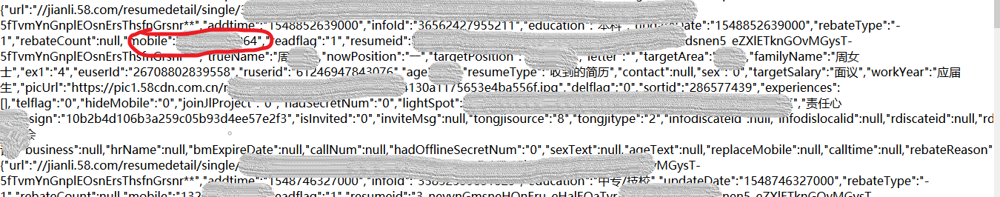

简历回收站和收到的简历类似，然而唯独缺少的就是手机号码。猜测由于简历待回收，所以58对手机号码进行了保护，如图：

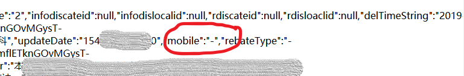

经过一些辛苦的步骤，终于解决了这个问题，我觉得解决的思路可能对自己和正在读本文的你以后的学习工作会有一定的帮助，所以决定简单的记录一下。

**完整项目地址在文末 **

## 正文开始

#### 发现问题

当我遇到json中的手机号被保护时，发现简历详情页的手机号码是正常显示的，所以真正的手机号码是被加载到本地的，然而当选择手机号的时候发现都是方框：

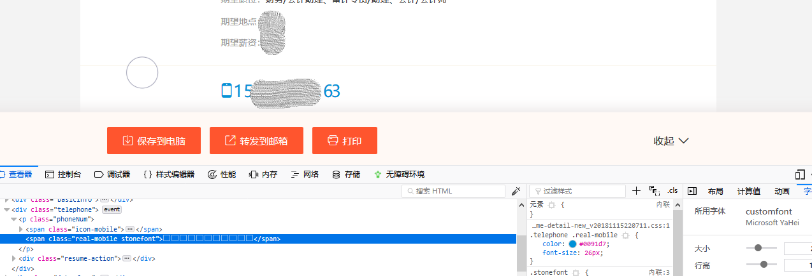

以我的经验，应该是对手机号码的字体进行了反爬处理，所以下面要做的当然是解密啦

#### 搞清问题

首先我想找到字体被加密成什么样了，所以我查看了一下网页源码，然而最后得到的结果让我很失望：

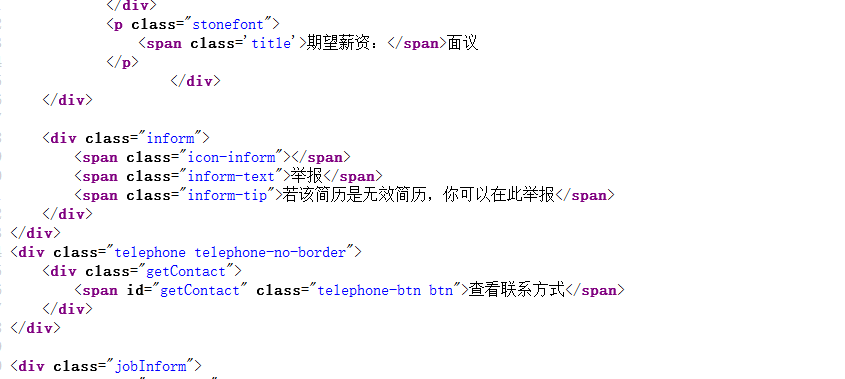

上图是网页里手机号码应该在的地方，然而源码显示的和控制台调试显示的根本不一样，根据经验推测：加密过的手机号码是在加载网页的同时被显示在页面上的，所以很有可能是通过js加载的；

继续欣赏源码：

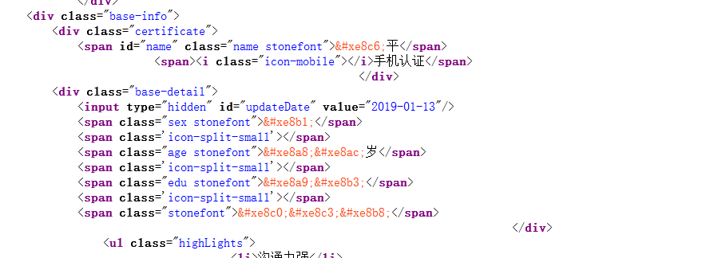

将源码向上翻可以发现有很多信息也被加密了，对比图三可以发现，两图的共同点是同属于一个class：stonefont，到这里，就完全可以肯定我之前的所有假设了：字体加密、js加载

#### 解决问题

<b>首先解决字体加密的问题</b>

依旧欣赏源码，直接Ctrl+F搜索stonefont，第一个结果显然就是我要的字体了：

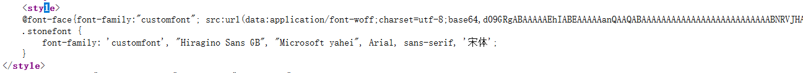

谷歌搜了一下，这个反爬字体好像没什么特殊的地方，是一个base64编码的动态字体，也就是每次加载网页每个字符的编码都会改变，所以接下来我要得到字体的woff文件和xml文件好好分析一下，那么欣赏一下关键代码吧！

```python
import base64
from fontTools.ttLib import TTFont, BytesIO
def make_font_file(base64_string: str):
	bin_data = base64.decodebytes(base64_string.encode())
	with open('./58tmp.woff', "wb") as f:
		f.write(bin_data)
	return bin_data
def convert_font_to_xml(bin_data):
	font = TTFont(BytesIO(bin_data))
	font.saveXML('./58tmp.xml')
if __name__ == '__main__':
    convert_font_to_xml(make_font_file(base_str))
```

base_str即源码里的base64编码，太长省略，得到需要的文件，我马上对两个文件进行了分析，这里需要用到一个字体工具：High-Logic FontCreator，用它打开刚刚的woff文件：

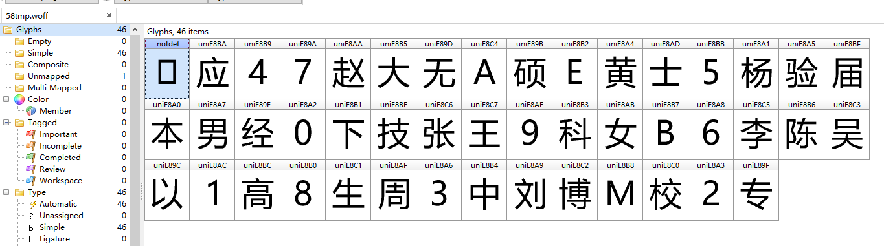

每个字符上面就是这个字符在xml文件里的name，不太清楚的话再打开xml文件：


关于字体xml文件我多说几嘴：每个字符都有个id和name，通过name在xml的文件cmap里面可以得到这个字符的code，如图：

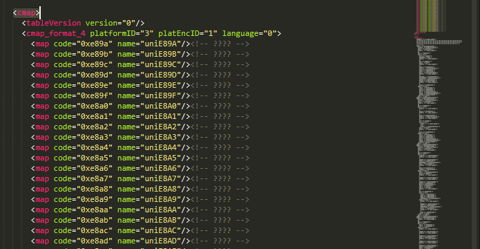

接着，通过字符的code就可以找到字符TTGlyph，即字符的图形坐标等信息：

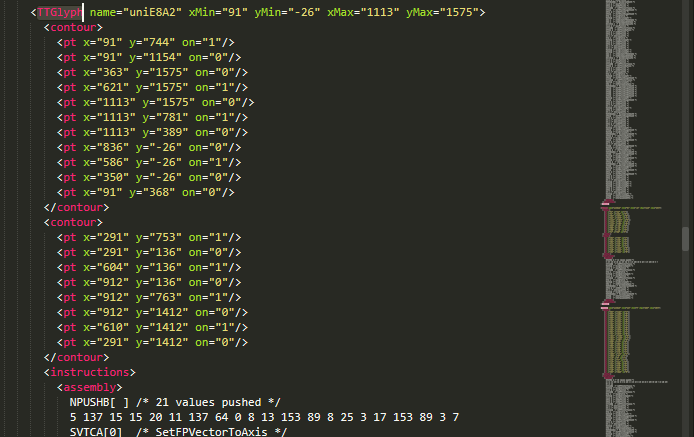


上面提到，每次加载网页，字符的编码都会改变，那么要辨别字体到底是什么唯一可以依靠的就是TTGlyph，因为它是不变的，所以我得到了解密字体的思路：

> - 保存一套字符的对应关系到本地，包括TTGlyph、字符的真正含义；
> - 每加载一次网页就得到此网页的base64字体并将其保存为xml文件；
> - 得到简历详情页的加密手机号的每个字符code，根据每个code找到每个字符的name，再根据name找到每个字符的TTGlyph，得到当前的code、TTGlyph对应关系；
> - 最后将当前对应关系与本地保存的对应关系进行比较，得到真正的手机号码。

到这里字体加密的问题算是解决了，欣赏一下关键代码：

```python
import re
# 本地对应关系
posi_dict = {
	'" xMin="91" yMin="-26" xMax="1113" yMax="1575': 0,
	'" xMin="212" yMin="0" xMax="764" yMax="1583': 1,
	'" xMin="119" yMin="0" xMax="1093" yMax="1575': 2,
	'" xMin="143" yMin="-26" xMax="1049" yMax="1575': 3,
	'" xMin="17" yMin="0" xMax="1162" yMax="1549': 4,
	'" xMin="174" yMin="-27" xMax="1054" yMax="1549': 5,
	'" xMin="118" yMin="-26" xMax="1115" yMax="1575': 6,
	'" xMin="111" yMin="0" xMax="1095" yMax="1549': 7,
	'" xMin="98" yMin="-25" xMax="1103" yMax="1575': 8,
	'" xMin="100" yMin="-26" xMax="1094" yMax="1575': 9,
}
def get_number_dict(base_str, code):
	convert_font_to_xml(make_font_file(base_str))
	name_dict = {}
	font_dict = {}
	font_list = []
	lines = ''
	sec_code = re.sub(r'&#', '0', code)
	code_list = re.split(r';', sec_code)[:-1]
	#得到所有键值对
	with open('./58tmp.xml', 'r', encoding='UTF-8') as f:
		line = f.readlines()
		line = str(line)
		while line:
			lines += line
			content = re.findall(r'code="([^"]*?)" name="([^"]*?)"', line)
			if content:
				font_list = content
			line = f.readlines()

	#得到name字典
	for font in font_list:
		if font[0] in code_list:
			name_dict[font[0]] = font[1]

	# 得到数字坐标信息
	for key in name_dict:
		cmp = re.search(r'<TTGlyph name="' + name_dict[key] + '(.*?)">', lines)
		font_dict[key] = cmp.groups()[0]
	return font_dict, code_list
#url：简历详情页url，driver：selenium的webdriver对象
def get_mobile(url, driver):
	sec_code, base_str = get_secure_code(url, driver)#这个属于第二个问题，得到js加载的sec_code问题
	font_dict, code_list = get_number_dict(base_str, sec_code)#font_dict：当前对应关系，code_list：11位sec_code组成的列表
	mobile = ''
	for code in code_list:
		pos = font_dict[code]
		if pos in posi_dict:
			mobile += str(posi_dict[pos])
	return mobile
```

<b>接着解决手机号码Js加载的问题</b>

既然要解决这个问题，那么我就得仔仔细细地查看网页的js代码，其实这个过程既可以很漫长，也可以几分钟就找到，为什么呢，看看我是怎么找的吧

1. 首先要清楚，js加载html标签，也无非就是在js里面进行字符串拼接而已，那么我一定可以在js代码里面搜索到js加载的html标签内容

2. 清楚了1，那就好办了呀，图三是js加载之后的html内容，图四是加载之前，那么我搜索任意一个就可以，我选择搜索图三的内容：

   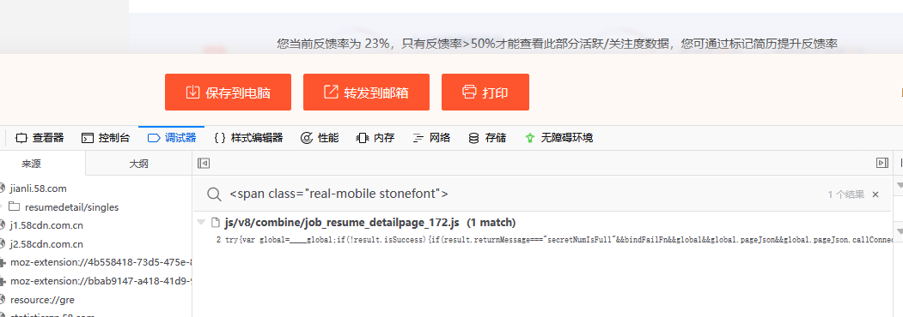

   只用了一次就找到了

3. 现在查看这个js文件，跳到match到的地方：

   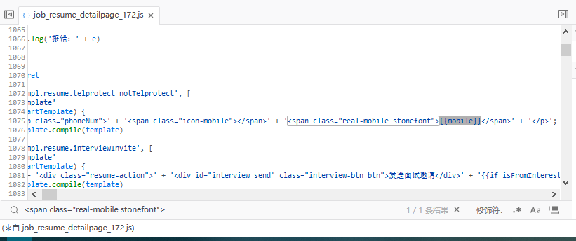

   可以看到{{mobile}}这个变量存放的肯定就是加密的手机号code

4. 所以我继续分析这个mobile变量到底存的是什么：

   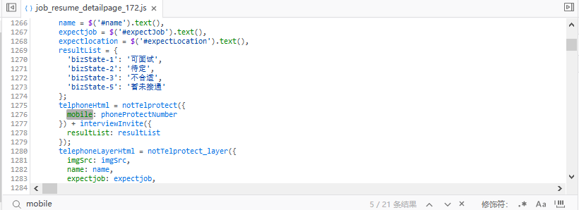

   我搜到第5个的时候，看到这个value，剩下的16个已经不好意思看了，可以确定mobile存放的是phoneProtectNumber的值

5. 那么phoneProtectNumber存的是什么呢：

   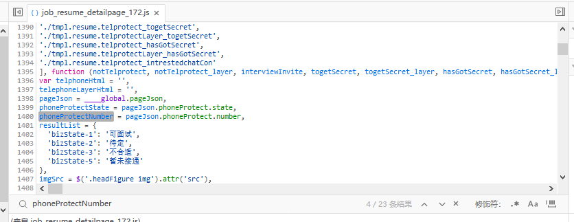

   找到了，顺便把pageJson是什么也找到了

6. 最后的结果为：

   ```javascript
   ____global.pageJson.phoneProtect.number
   ```

   熟悉js的朋友应该了解\_\_\_\_global也就是window.\_\_\_\_global，所以结果也可以是:

   ```javascript
   window.____global.pageJson.phoneProtect.number
   ```

   在cosole中验证一下：

   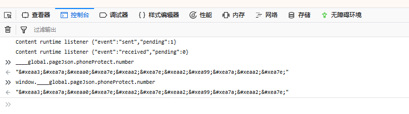

现在两个问题都解决了，那么58的这个手机号码反爬机制自然也就破解咯~

## 文末总结

文章最后我还是想说点儿什么，关于js加载的问题，由于我是用python写的爬虫，朋友你也应该知道，python的各种爬虫库是无法调试js的，更不用说支持console这种东西了，所以最后为了完整实现我没有办法还是使用了无界面浏览器PhantomJS，通过selenium.webdriver模拟console执行：

```javascript
console.log(window.____global.pageJson.phoneProtect.number);
```

得到sec_code。

欣赏一下关键代码吧：

```python
from selenium import webdriver
import time
#cookie：浏览器cookie
def get_driver(cookie):
	pattern = re.compile(r'(.*?)=(.*?);')
	cook = re.findall(pattern, cookie)
	cookies = {}
	for c in cook:
		cookies[str(c[0])] = c[1]
	driver = webdriver.PhantomJS()
	driver.get('https://employer.58.com/')
	driver.delete_all_cookies()
	for c in cookies:
		try:
			driver.add_cookie({'name': str(c), 'value': str(cookies[c])})
		except:
			pass
	time.sleep(1)
	driver.refresh()
	return driver
def get_secure_code(url, driver):
	driver.get(url)
	time.sleep(1)
	script = 'console.log(window.____lobal.pageJson.phoneProtect.number);'
	driver.execute_script(script)
	secCode = list(driver.get_log('browser'))[0]['message']
	html = driver.page_source
	basrStr = re.search(r'src:url\(data:application/font-woff;charset=utf-8;base64,(.*?)\)', html).groups()[0]
	return secCode, basrStr
```

这里面有一个小插曲：当我使用PhantomJS打开简历详情页，并输出页面源码时发现原本应该不显示的加密手机号竟然被输出了，直到这时我才了解到这个PhantomJS竟然还有这种操作，那么现在得到js加载的手机号码就有两种方法了：

1. 使用无界面浏览器PhantomJS打开url，并模拟console执行console.log
2. 使用无界面浏览器PhantomJS打开url，输出page source，再使用正则表达式匹配

