前情提要
------

#### 起源

在码市上看到了一个价值 1000 RMB 的项目：**耐克官网模拟登录**，唯一要求是纯代码模拟登录。

原本觉得不会有多难，抱着试一试的想法搞了一天，没想到的是，真的是刷新了我对网站 Cookie 使用的认知，**Cookie 还可以这么玩？**

#### 声明

关于登录信息的提交这些，和其他网站一样，都是简单的表单 Post，不必多说，关于网站接口的 url 我会在详细说到的时候给出

完整实现代码，本篇文章不会给出，因为在大多数情况，这类代码属于**灰产**，所以本着学习交流的心态，我只分享一下思路

#### 准备

工具

- 火狐浏览器：Hacking 必备
- 火狐插件：Cookie AutoDelete 方便重置网站 Cookie
- [js_beautify](https://www.html.cn/tool/js_beautify/) js 代码解压缩
- vscode 编辑器 用于查看编辑 js 代码

开发

- 环境：Python，NodeJS
- Idea：PyCharm
- python 库：requests，execjs，uuid 
- node 库：jsdom

准备阶段
------

以下将采用大量截图的方式，重现分析过程，流量党告退

#### 登录接口

想要模拟登录，当然是直接从登录接口下手

**接口信息如下：**

##### URL

```html
https://unite.nike.com/login
```

##### 查询字符串

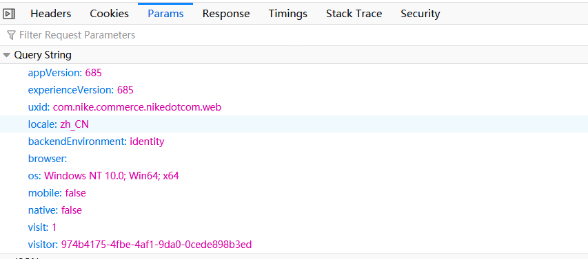

##### Request Headers

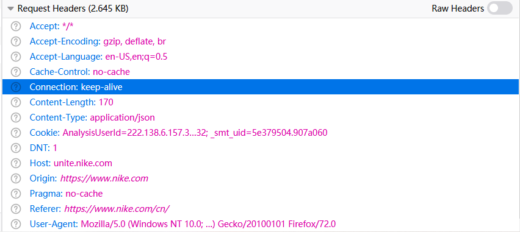

##### Request Cookie

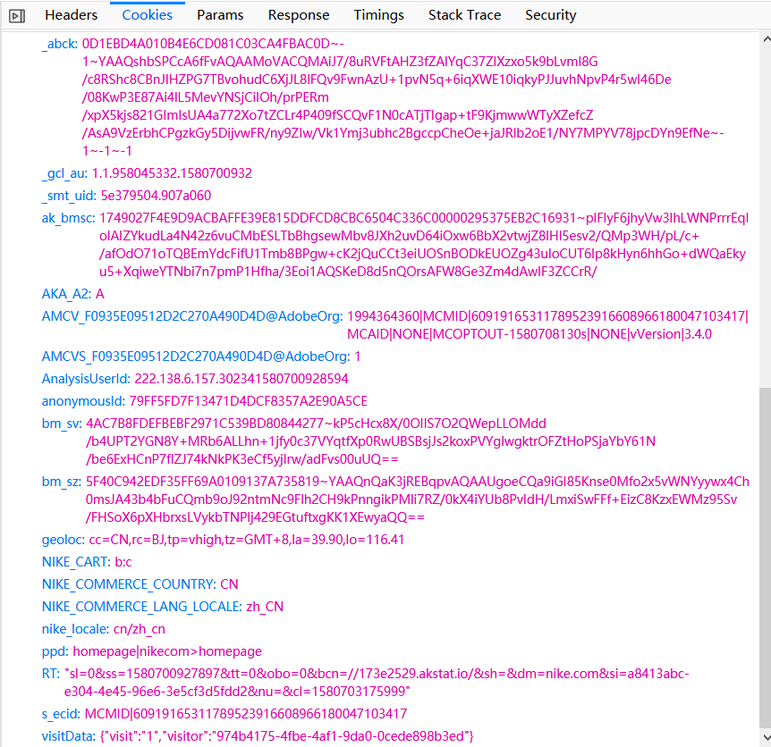

##### Request Payload

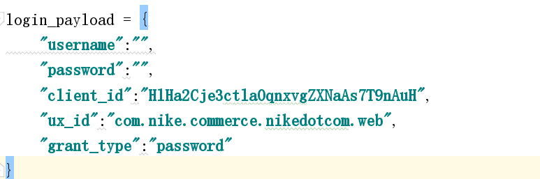

Ok，齐活

#### 接口精简

可以看到，这个登录接口相当复杂，所以和平常一样，试着精简请求，**逐渐得到最精简的接口**

以下过程全部使用火狐开发者工具的**编辑重发**功能，过程省略

只强调一点，由于登录接口有使用次数限制，为了避免重复登录封号以及太累，所以我采取了以下措施：

- **优先精简**了部分比较麻烦的字段
- 使用**故意使用错误的用户信息登录**得到的 **"401"** 错误来判断字段是否精简成功
- 在**火狐隐私窗口**进行所有测试工作：解决登录次数过多出现的错误窗口

**精简结果如下：**

1. 查询字符串

   ```json
   'uxid': 'com.nike.commerce.nikedotcom.web',
   'locale': 'zh_CN',
   'backendEnvironment': 'identity',
   'visit': '1',
   'visitor': '',
   ```

2. Headers

   ```json
   "User-Agent": "",
   "Content-Type": "application/json",
   "Cookie": "",
   ```

3. Cookie

   ```json
   "bm_sz": "",
   "_abck": "",
   ```

Ok，现在看起来是不是友好多了？

#### 尝试登录

好的，现在我要试一下直接使用浏览器中的登录接口是不是在代码中也可以正常登录，标志就是能否得到正常的响应

**不出所料，Idea 中运行失败，而在浏览器中正常**

好的，到目前为止，准备过程结束，而**真正的游戏才刚刚开始**

#### 初步总结

1. 查询字符串的：visit 字段似乎每**切换账户名登录一次**，visit 的**值就加 1**，至于它是依据什么存储这个值的，我猜是根据 cookie

2. 查询字符串的：visitor 字段似乎是**随机产生**的，推测是在**本地浏览器直接生成**的，而且形式为**通用唯一识别码**的格式，最关键的是**第 13 位都为 4**，形如：

   ```shell
   xxxxxxxx-xxxx-4xxx-xxxx-xxxxxxxxxxxx
   ```

3. Headers 的：Content-Type 字段为 json 是因为登录成功的响应体为 json 故必须加上

4. Cookie 的两个字段看不出含义，但是根据在代码中模拟登录失败的经验，我可以确定地说，这两个字段**在登录请求之前向服务器进行了验证**

分析过程
------

#### 登录过程

好的，现在我要从头分析一下从我**打开首页**到**登录成功**的过程中，浏览器都做了哪些**额外的动作（额外的，看起来不必要的请求）**，而这些**请求**很可能就是**使用代码模拟登录**失败的原因

按照以往的经验，我只检查 **html** 和 **xhr** 类请求即可，并且根据上文的总结，我**只关注和 Cookie 两个字段相关的请求**，因为**其他字段很可能是在本地浏览器生成的**

##### 打开首页

在没有任何记录的情况下打开首页可以收到如下的请求：

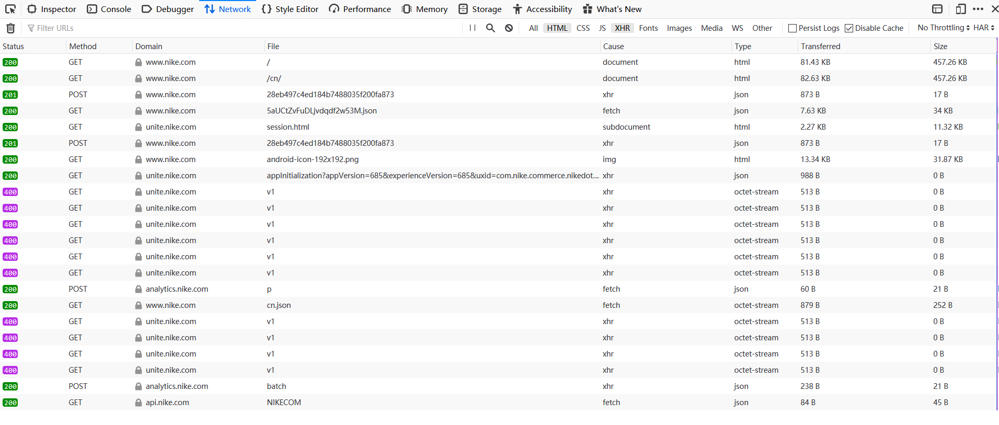

设置过滤器过滤掉无用的 400 及 octet-stream


依次查看之后，我发现了如下可疑的现象：

- 几乎所有请求疯狂使用响应头的 **set-cookie** 字段**实时更新 Cookie**

- 其中，一个**可疑链接**对 **_abck 字段**进行了实时更新，另外，由于只加载了主页没有进行其他动作，两次更新的原始 **_abck 都是最初的那个**，其中最可疑的是，**它的请求体**是这样的（**浏览器指纹，非常详细且恶心**）：

  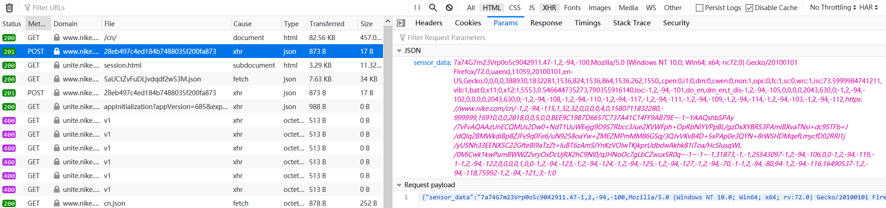

- 另外，在浏览器中只查看此可疑链接，发现它其实是一个 Js 文件，如图：

  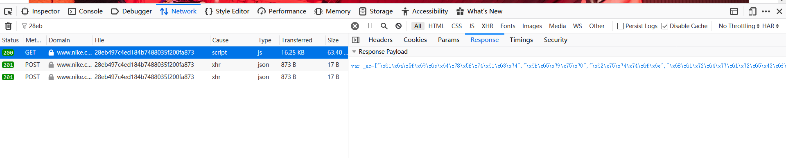

这下思路其实已经很明朗了，总结一下，我们在模仿登录时，也需要通过上面的链接得到最新的 _abck 的值，并且向服务端 post **sensor_data** 即浏览器指纹（下面会做详细介绍），而链接本身为一个 Js 文件，**猜测此链接根据请求信息可以生成 sensor_data**

##### 点击登录

不出所料，可疑链接又出现了，那么它的功能我大致了解了：

- **记录鼠标轨迹**
- **更新 Cookie 的 _abck**
- 向服务端 Post **浏览器指纹**，其中包括 Cookie 和 鼠标轨迹

##### 登录完成

在登录请求成功之后，浏览器又做了两次至关重要的请求（分别设置了登录完成可获得的 Cookie），这两个请求在本篇文章就不说了，比较简单，只要登录请求可以模拟，这两个链接的请求根本不是问题

- https://unite.nike.com/auth/unite_session_cookies/v1
- https://unite.nike.com/auth/slcheck_cookies/v1

#### 测试过程

所以，我只需测试可疑链接即可，解决了它，其他问题都迎刃而解了

##### 可疑链接什么条件下会触发？

经过测试可知，只要鼠标点击就会触发，而且有一个有意思的现象，**摁下回车键确定登录时可疑链接没有触发**，这意味着什么呢？这意味着两者没有区别，所以可疑链接是**没有必要实时更新请求**的

请看如下比较便知，回车登录除了缺少点击登录按钮时提交的可疑链接的请求，其它请求一模一样

- 鼠标点击登录得到的请求

  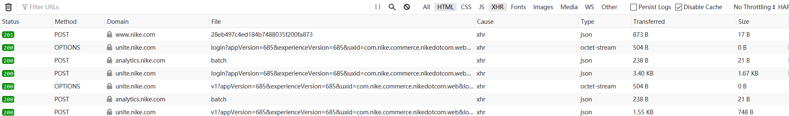

- 回车确认登录得到的请求

  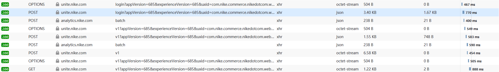

##### 可疑链接真的在记录鼠标轨迹吗？

随便测试一下可知，它真的在记录

##### 鼠标轨迹服务端检测了吗？

**目前的情况来看是没有的**，在此基础上我在随便点击了多次其它位置之后或者随意更改了鼠标轨迹坐标之后，重发登录的请求还是可以成功

##### 可疑链接真的有必要实时模拟多次吗？

根据以上测试结果来看，**没有必要**，只要在登录之前请求过一次就行了

#### 分析总结

经过分析我得到如下结论：

1. 解决模拟登录只需解决可疑链接即可
2. 可疑链接只需请求一次
3. 鼠标轨迹就是走走形式，服务端不会检测（说不定耐克以后会根据情况改成检测，不过也没有多麻烦，解决思路也很简单）

解决过程
------

好的，到了这里我的思路已经足够清晰了，在实现模拟登录之前，我还要解决不少棘手的问题

#### 问题总览

我需要解决的问题有：

1. 查询字符串的 visitor 字段是如何生成的
2. 初始 Cookie 如何获得，由于需要纯代码获取，手动复制是不行了
3. 可疑链接的 sensor_data 生成原理和过程是怎样的，链接与服务端是如何交互的，我都需要一清二楚

#### 问题一

上文提到，visitor 是随机生成的 uuid，而且也给出了它的形式，所以我进行了下图所示的搜索：

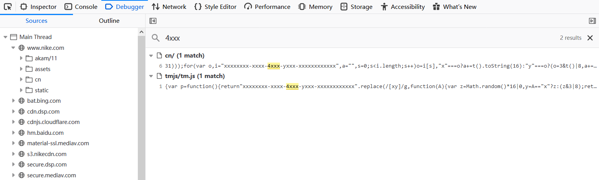

可以看到得到了两个结果，而且我对第二个 js 中的相关代码下断点调试（过程略），断点不会被触发

因此，结论很显然了，visitor 是通过主页内嵌的这段代码生成的

还有一个值得注意的细节，除了 visitor 我在请求中还发现了很多相同格式的 uuid，这也更加说明了 visitor 就是浏览器本地随机产生的，我完全可以模拟这个过程，所以我把那段代码 copy 了下来运行了一下：

Js 代码：

```javascript
function r() {
    function t() {
        return n ? 15 & n[e++] : 16 * Math.random() | 0
    }
    var n = null,
        e = 0,
        r = window.crypto || window.msCrypto;
    r && r.getRandomValues && (n = r.getRandomValues(new Uint8Array(31)));
    for (var o, i = "xxxxxxxx-xxxx-4xxx-yxxx-xxxxxxxxxxxx", a = "", s = 0; s < i.length; s++) o = i[s], "x" === o ? a += t().toString(16) : "y" === o ? (o = 3 & t() | 8, a += o.toString(16)) : a += o;
    return a
}
```

Python 代码：

```python
#!/usr/bin/env python
# -*- encoding: utf-8 -*-

import execjs

def generate_visitor_id():
	js = '''
		const jsdom = require("jsdom");
		const { JSDOM } = jsdom;
		const dom = new JSDOM(`<!DOCTYPE html><p>Hello world</p>`);
		window = dom.window;
		document = window.document;
		function r()
		{
		    function t()
		    {
		        return n?15&n[e++]:16*Math.random()|0
		    }
		    var n=null,e=0,r=window.crypto||window.msCrypto;
		    r&&r.getRandomValues&&(n=r.getRandomValues(new Uint8Array(31)));
		    for(var o,i="xxxxxxxx-xxxx-4xxx-yxxx-xxxxxxxxxxxx",a="",s=0;s<i.length;s++)
		        o=i[s],"x"===o?a+=t().toString(16):"y"===o?(o=3&t()|8,a+=o.toString(16)):a+=o;
		    return a
		}
	'''
	p = execjs.compile(js, cwd=r'./node_modules')
	return p.call('r')
	
if __name__ == '__main__':
	vid = generate_visitor_id()
	print(vid)
```

运行结果：


**Ok，问题解决**

#### 问题二

很简单，只需几行代码：

```python
#!/usr/bin/env python
# -*- encoding: utf-8 -*-

import requests

if __name__ == '__main__':
	session = requests.Session()
	url = "http://www.nike.com/cn"
	resp = session.get(url=url, headers=index_headers)
	cookie = resp.request.headers.get("Cookie")
	print(cookie)
```

运行结果：

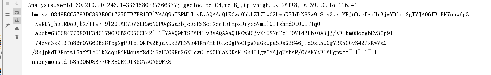

#### 问题三

最棘手的问题

我已经知道 sensor_data 生成的 js 代码：

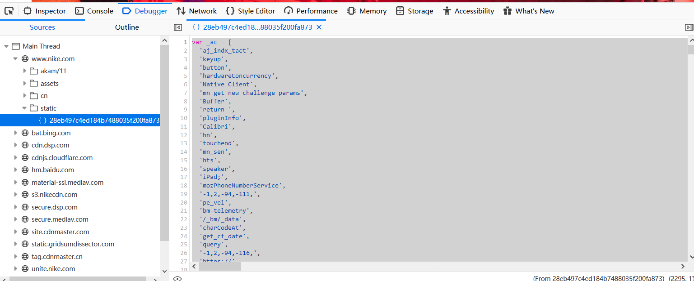

大致浏览了代码，我发现，代码中没有涉及到任何与耐克相关的东西，也就是说，这个代码是纯静态的，而且没有经过混淆

试着搜索 "sensor_data"，我找到了一个字典，这正是我需要生成的 sensor_data：

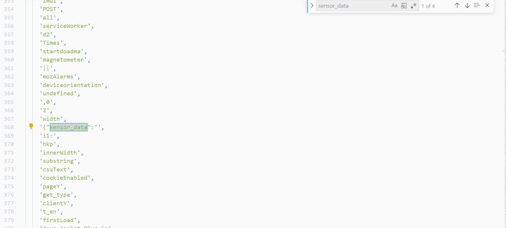

而且，字典中的每个变量都可以通过此静态代码直接获取，比如我直接搜索这个 **hkp**：

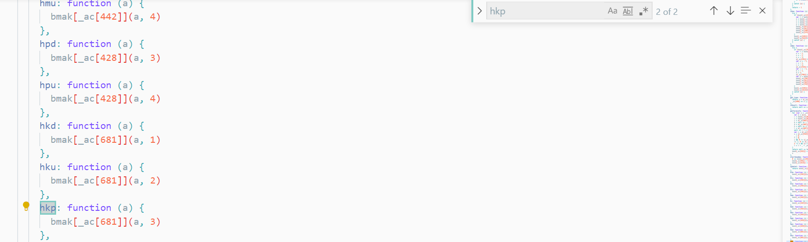

顺便还发现了好多其他字段的函数，这些字段都是通过**匿名函数**生成的，而且都和 **bmak** 这个列表有关

好的，我直接跳到了第一个 **bmak** 的地方，可以看到非常多的常量：

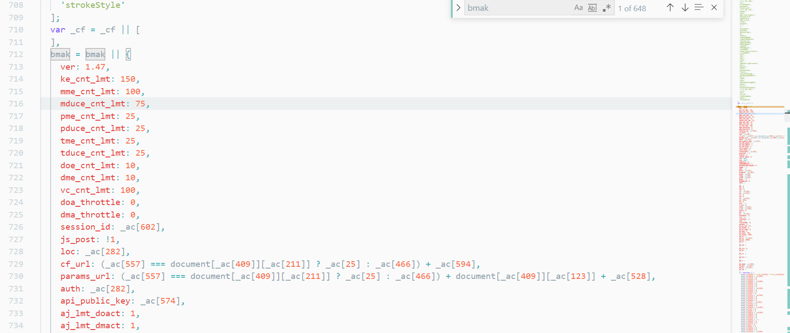

好的，就说到这里，那么问题解决的思路就很明朗了，有如下几个思路：

1. 按照此静态代码的逻辑自己改成 python 代码或者重新组织 js 的结构放到本地服务器上面运行生成 sensor_data，只要完成，无论耐克的后台搞什么猫腻，都可以保证代码的鲁棒性，但是由于代码量巨大，虽然这样很帅却不推荐
2. 上文已经分析过，耐克后台并没有检测全部的指纹信息，所以我们只需改写关键字段的函数即可，比如 _abck 的函数，时间戳的函数等等，这样也可以成功，但是需要对代码进行维护，没准哪天耐克就改了
3. 完全不理这个静态代码，复制一个 sensor_data 模板，只更换其中的 _abck 用来验证 Cookie，可能会失败，但是实现最简单

其实并没有多难，对吧

结束寄语
------

以上就是耐克官网模拟登录的思路，剩下的工作就是编写代码上面的逻辑实现即可

​     

   