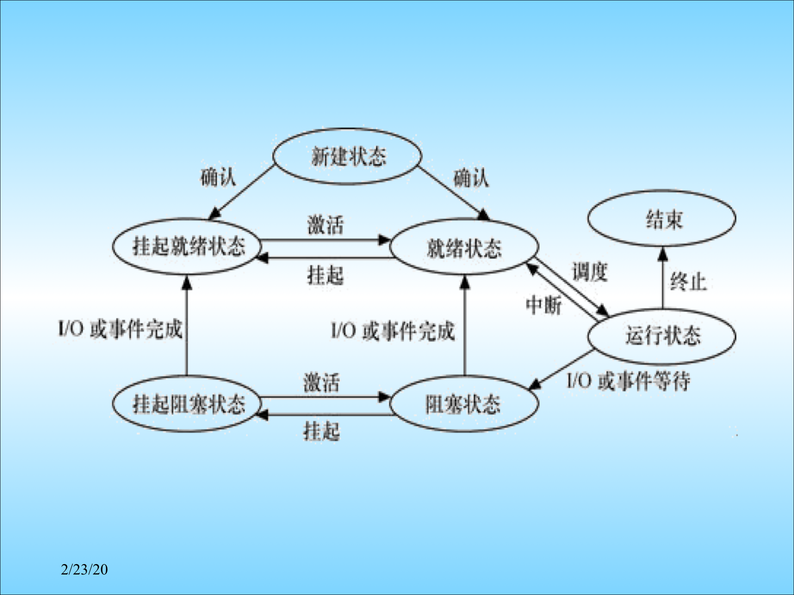
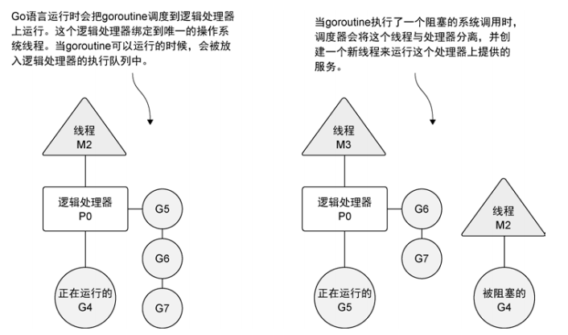

本文基于 [tour.go-zh.org](https://tour.go-zh.org)、[MIT 6.824 Lecture 2](https://pdos.csail.mit.edu/6.824/notes/l-rpc.txt)、[Go 语言并发编程与 Context | Go 语言设计与实现 (draveness.me)](https://draveness.me/golang/docs/part3-runtime/ch06-concurrency/golang-context/) 及 [实效Go编程 - Go 编程语言 (go-zh.org)](https://go-zh.org/doc/effective_go.html) 中对应的部分内容。

## 并发的本质

并发编程是程序设计中十分重要的一个部分，主要涉及两个方面的目标，一是 IO 复用，二是 CPU 复用，通常情况下，我们所谈及的并发其实都是 IO 复用。

一个进程在其本身的地址空间内创建多个共享公用资源的线程以复用进程资源，多线程允许一个程序可以在自己的执行周期内完成更多的任务。每个线程均是串行执行的，在宏观上这些线程是**并发执行**的。每个线程均拥有自己的线程状态，就像进程一样，包括程序计数器、寄存器、栈。

IO 复用的本质是，在一个线程占用内存等互斥资源的同时，其他线程可以执行另外的无需占据资源的任务，这极大改善了由于资源占用从而阻塞程序所导致的 IO 利用率低下的问题。

而 CPU 复用，即利用现代处理器所提供的多个核心，达到真正意义上的**并行执行**。

## Go 中的并发编程

### 调度器

在谈到调度时，离不开操作系统、线程、进程这些概念。线程是 OS 任务调度的基本单位，而进程是 OS 资源分配的基本单元，线程和进程的调度模型大体相同，Linux 中的调度器就没有区分进程和线程。

按照经典的进程调度模型，一个进程的生命周期如图所示 (来自于不知名 PPT)，经历 7 个生命阶段，其中，经常提及的精简模型，不包括挂起状态，线程的生命周期和进程类似。除此之外，进程和线程都只是 PCB 和 TCB 的抽象，进程控制块和线程控制块是进程和线程的具化，保存了进程和线程执行和调度时的状态信息。

进程和线程之间的关系可以简单地理解为一种 “亲子” 关系，一个进程可以创建多个用户级线程或执行系统调用创建内核级线程，线程之间相互独立，且共享同一个父进程的地址空间。

对于用户级和内核级线程的联系和区别，这里不做详谈，只需了解以下：

-   用户级线程的生命周期的控制、状态信息的变更、上下文环境的切换均由父进程自身来完成，可以进行**快速的上下文切换**，但是无法利用多核心 CPU，微观上均是串行的。
-   内核级线程则交由 OS 来直接控制，**可以利用多核心达到并行**，但是会有额外的上下文环境切换开销。
-   内核级线程具有与用户级线程的对应关系，可以是一对一、多对一或者多对多。其中多对多关系的实现非常复杂，也可以称之为二级线程模型，**M 个用户线程对应 N 个内核线程**。

Go 则在此二级线程模型的基础上实现了一种 **MPG** (也称为 GMP、MGP) (*Machine-Processor-Goroutine*，内核线程-上下文-用户线程)模型。这里借用一下网络上的 MGP 模型图，其中 M 即用户级线程、P 是逻辑处理器、G 可视为用户级线程，只有 M 是与核心一一相关的。

2012 年 Google 的工程师 Dmitry Vyukov 在 [Scalable Go Scheduler Design Doc](http://golang.org/s/go11sched) 中提出引入 Processor 中间层逻辑处理器来改善传统二级线程调度模型的问题，完成 **G 调度队列的维护**、**M 和 G 调度上下文的衔接**及 **M 和 G 的任务对接**，并在此基础上实现**基于任务窃取的调度器**，由于调度器实现及原理十分复杂，日后再谈。

### Goroutine

在 Go 中，可以使用 `go func(){}()` 或是提供具体的函数字面来启动一个 Goroutine 来并发执行这个函数，Go 的函数字面都是闭包。

它是非常轻量级的，所有消耗几乎只有栈空间的分配，栈最开始是很小的，仅在需要时才会随着堆空间的分配和释放而变化。

Goroutine 总共具有 9 种可能的状态，包括：

| 状态          | 描述                                                         |
| ------------- | ------------------------------------------------------------ |
| `_Gidle`      | 刚刚被分配并且还没有被初始化                                 |
| `_Grunnable`  | 没有执行代码，没有栈的所有权，存储在运行队列中               |
| `_Grunning`   | 可以执行代码，拥有栈的所有权，被赋予了内核线程 M 和处理器 P  |
| `_Gsyscall`   | 正在执行系统调用，拥有栈的所有权，没有执行用户代码，被赋予了内核线程 M 但是不在运行队列上 |
| `_Gwaiting`   | 由于运行时而被阻塞，没有执行用户代码并且不在运行队列上，但是可能存在于 Channel 的等待队列上 |
| `_Gdead`      | 没有被使用，没有执行代码，可能有分配的栈                     |
| `_Gcopystack` | 栈正在被拷贝，没有执行代码，不在运行队列上                   |
| `_Gpreempted` | 由于抢占而被阻塞，没有执行用户代码并且不在运行队列上，等待唤醒 |
| `_Gscan`      | GC 正在扫描栈空间，没有执行代码，可以与其他状态同时存在      |

>   上表来源于：[Go 语言调度器与 Goroutine 实现原理 | Go 语言设计与实现 (draveness.me)](https://draveness.me/golang/docs/part3-runtime/ch06-concurrency/golang-goroutine/#g)

Goroutine 的状态迁移也比较复杂，暂不深究【此处待补充】。

### 基本原语

在 OS 中，对于内核级线程和进程，为了解决同步和互斥这样的直接制约和间接制约关系，OS 提供了一系列的原语，包括互斥信号量、整型信号量、记录型信号量以及管程等。

同样的，对于 Goroutine，Go 也在 sync 标准库中提供了各种各样的原语来协助程序员进行并发控制，来避免竞争条件。

下面，简单地说明一下各种原语的用法

**sync.Mutex** 是最基本的互斥锁，提供了 `Lock()` 和 `UnLock()` 两个方法。其中 Lock 方法调用时，如果当前互斥锁的状态不是 0 (即已经上锁)，那么会执行 `lockSlow()` 以尝试通过**自旋**等方式来获取锁。

自旋是一种多线程同步机制，在进入自旋的过程中会持续占用 CPU 检查是否可进入自旋，进入自旋可避免 Goroutine 的切换，能够更好地利用多核资源，恰当使用可以极大改善程序性能，所以上述的进入自旋条件非常苛刻。

当调用 UnLock 时首先执行快解锁，如果失败则继续执行 `unlockSlow()` 慢解锁。

**sync.RWMutex** 是一种细粒度的互斥锁，可以理解为读者写者问题的一种复现，不限制并发读，但限制并发读写和并发写写。因此，它具有两对方法，分别为  `Lock()` 和 `UnLock()` 及 `RLock()` 和 `RUnLock()`

**sync.WaitGroup** 可以实现多个 Goroutine 的并发执行，提供了 Add()、Wait() 及 Done() 三个方法。Done 只是向 Add 传入 -1，同样也可以向 Add 传入确保等待组计数器非负的任意负数，来快速唤醒一系列 Goroutine，而 Wait 方法在计数器为 0 后会立即唤醒其余睡眠的 Goroutine 并立即返回，WaitGroup 只有在 Wait 方法返回后才可以被重用。

**sync.Once** 确保 Go 程序执行期间某段代码只会执行一次，提供了 Do 方法。

**sync.Cond** 是条件变量，它可以实现满足特定条件下同时唤醒多个 Goroutine 称为 **“条件广播”**。提供了 `Wait()` 和 `Broadcast()` 方法，使用 `sync.NewCond(&sync.Mutex{})` 来创建。

【什么时候使用什么原语】

## 并发的挑战

同一个程序的 Go 程在相同的地址空间中执行，所以必须考虑下面这些问题：

- 共享数据。要确保访问互斥资源的原子性，需要对于代码中涉及共享数据的变量和处理逻辑进行严格地控制。Go 的 sync 标准库提供了 sync.Mutex (互斥锁)来解决这个问题。

- 线程间的协调。如在生产者和消费者的实例中，生产者需要唤醒消费者，消费者也要确定在何时停止阻塞或是直接放弃执行。Go 的 sync 标准库中也提供了 sync.Cond (条件变量)、sync.WaitGroup (等待队列) 及 channels (管道通信) 数据结构来解决这种问题。

- 死锁。以 channel 为例，有如下三种会触发死锁的常见情况：

  - 同一个 Go 程中，使用同一个 chan 来读写；
  - chan 的赋值操作先于用于读 chan 的 Go 程创建；
  - 多个 Go 程和多个 chan 发生环路等待。
  - channel、读写锁和互斥锁的交叉混用可能导致未知的死锁。如果必须混用，则推荐条件变量。

  可以采取周期性的锁检查或是基于 RPC、channel 通信的方式来解决。

## 通过通信来共享内存

上面提到了 Go 中解决并发编程存在问题的各种方式。在并发编程中，为实现对共享变量的正确访问和修改需要十分精确的控制，否则程序可能会出现未知的行为甚至会出现死锁，这其实是很困难的。

Go 中，Go 程被设计为从不会主动共享，在任意时刻，同时只会有一个 Go 程能够访问共享数据，这才源头设计上就杜绝了数据竞争的发生。也就是说，会导致数据竞争这种异常行为发生的只有不成熟的程序员 (在编译程序时可以加上 -race tag 来检查代码中潜在的可能导致数据竞争的逻辑)。

在文章 Effective Go 中提出了一个口号：

> 不要通过共享内存来通信，而应通过通信来共享内存。

在 Go 中，我们无需花费精力设计代码实现确保通信过程的同步，通信本身就是同步的，因此，我们也无需考虑其他同步了。

### Context

### Channel

Go 中的 Channel是一种特殊的数据类型，

### HTTP

### RPC

## 并发的实例

### Web Crawler

### Voting Counter

### KV Storage Server

